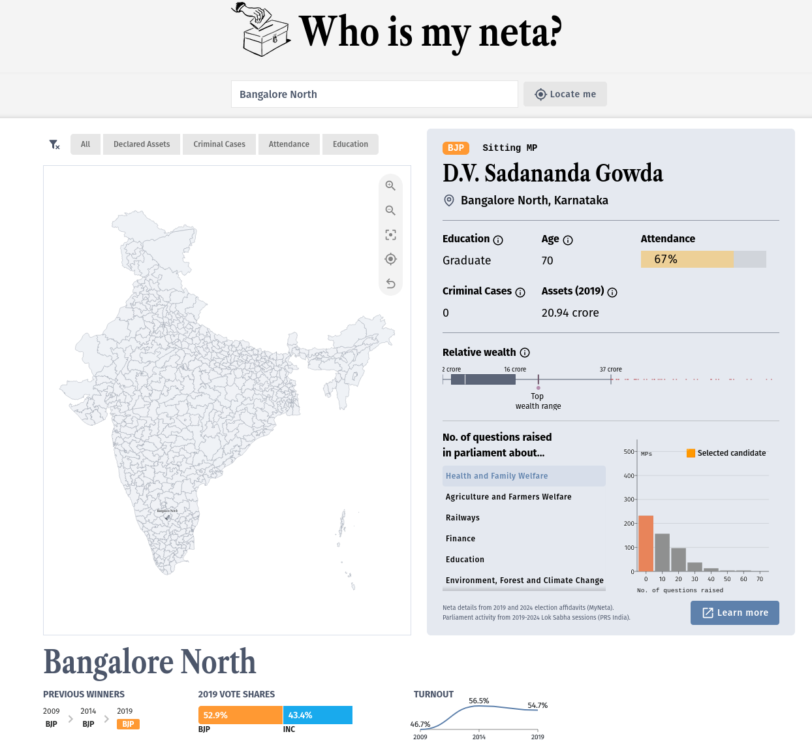
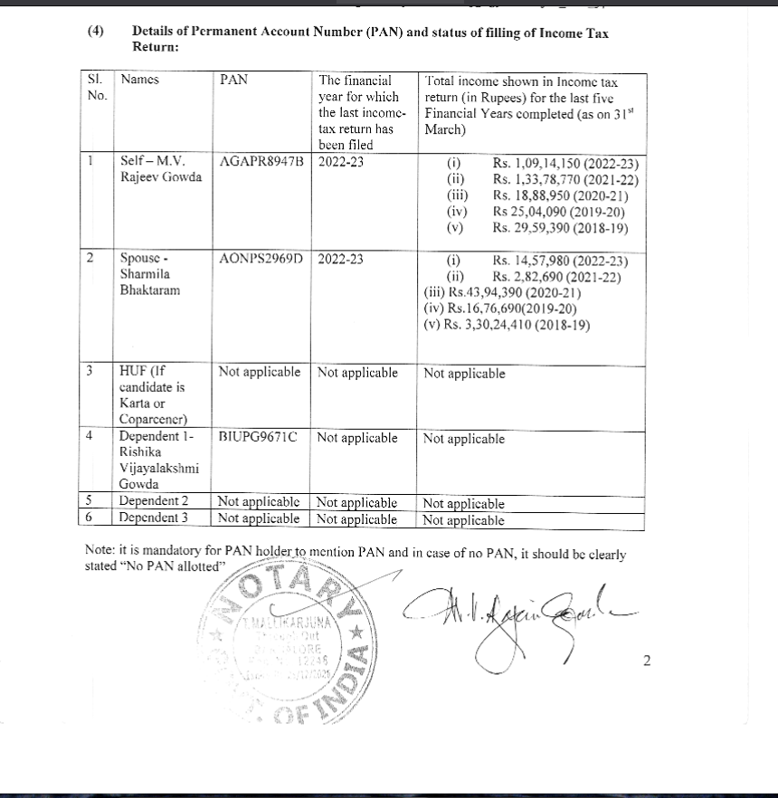
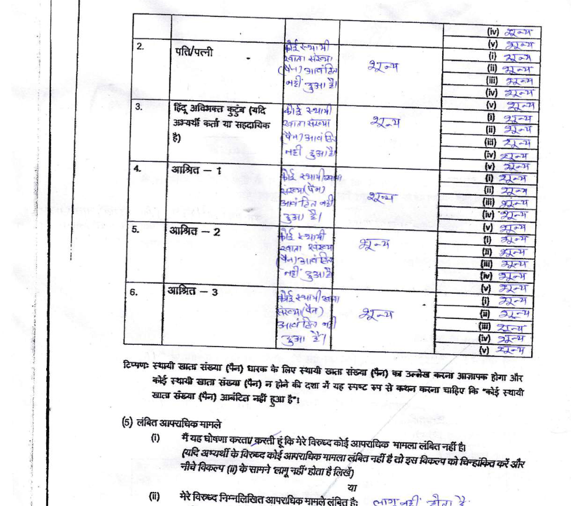
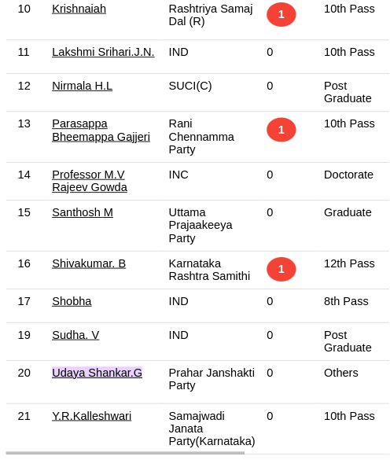
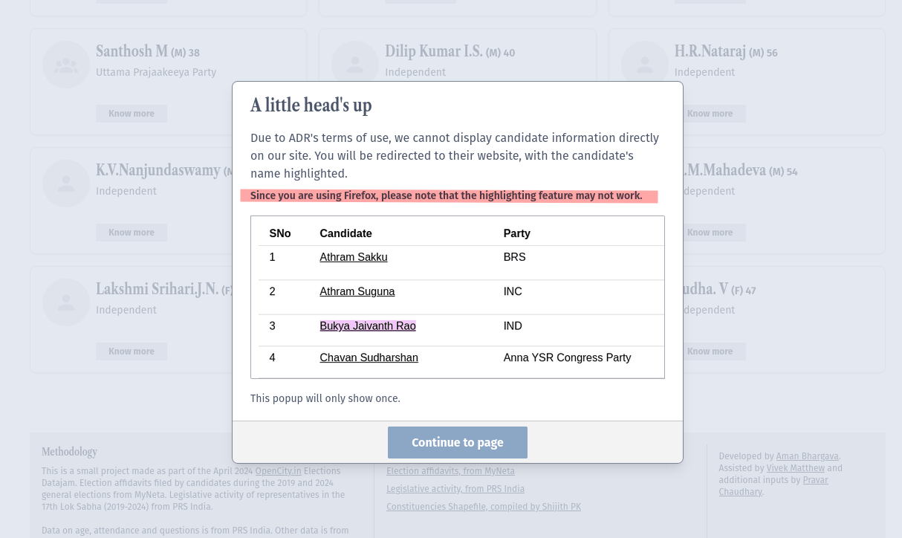
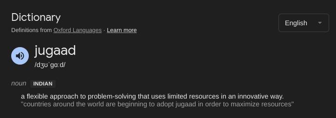

Earlier in 2024, I helped make [whoismyneta.com](https://whoismyneta.com) just before the Indian general elections, and it went a little viral, but an unexpected restriction was about to make the site useless at the very peak of its usefulness (and popularity). Though I say so myself, I think what we ended up doing to overcome it was quite clever. 



## Some background on Who Is My Neta 
 
In April, Opencity.in organized an online datajam around the theme of the 17th Lok Sabha elections, which I took part in along with my teammates [Vivek](https://twitter.com/Vonterinon) and [Pravar](https://twitter.com/bengawalk/). 

Vivek had already been collating data on legislative activity of parliament members as well as data from MyNeta.info run by the Association for Democratic Reforms (ADR). Their data is makes is assembled through candidate-submitted affidavits which contain information such as criminal cases, education level, and declared assets. This was data on the **current** MPs on their way out. He had the novel idea of joining these two datasets and creating a single explorer for them. It sounded great to me. 
 
For context, this project almost feels like a rite of passage for people interested in open data, politics, and building visualizations. By no means had the ADR data not been visualized before; here are just some projects that have done similar things: 

- https://www.reuters.com/graphics/INDIA-ELECTION-CRIMINAL-CANDIDATES/0100925031T/  
- [https://github.com/datameet/india-election-data/tree/master/affidavits](https://github.com/datameet/india-election-data/tree/master/affidavits "https://github.com/datameet/india-election-data/tree/master/affidavits")   
- [https://github.com/nini1294/myneta_api](https://github.com/nini1294/myneta_api "https://github.com/nini1294/myneta_api")   
- [https://github.com/bkamapantula/parliamentary-candidates-affidavit-data](https://github.com/bkamapantula/parliamentary-candidates-affidavit-data "https://github.com/bkamapantula/parliamentary-candidates-affidavit-data")  
- [https://github.com/kracekumar/myneta](https://github.com/kracekumar/myneta "https://github.com/kracekumar/myneta")   
- [https://github.com/manish-tcpd/myneta](https://github.com/manish-tcpd/myneta "https://github.com/manish-tcpd/myneta") 

And so on. You get the idea. People find this data useful, they also like to make stuff with it. 

What we were doing was different because of the join that Vivek had in mind (along with some better UI/UX decisions on how to make accessing this easy on the web interface). In a single place, you could see information that ADR had while also seeing how the parliamentarian had engaged with questions and debates in their term. We also had loftier ideas of more interesting stats like identifying turncoat candidates, but maybe that's for another day. 

Long story short, we built it (and I'll write about that in a future post). [I shared it](https://twitter.com/thedivtagguy/status/1783348279528329710). It went viral. Even though the data was not yet for the candidates contesting this year, people found it useful and shared the site widely. It spawned reels, videos, explainers on how to use it, and people sharing screenshots of their MPs, completely organically. A few days after the initial hullabaloo, I set up a Plausible instance to track (I'm usually very anti-analytics, but this was new, and I wanted to see what the numbers were this once) how many visits we were getting.  


That spike was after the surge of the first week, so the number of unique visitors would easily be 1.5–2 times more.  

All this to say, it had plenty of eyeballs on it, and we kept getting requests to update this with data for the candidates who would be contesting this year. Of course that would be useful, right? 

## You shall not scrape


To make sure that we were not doing something unwanted, we reached out to the open-data platform we had earlier scraped from and asked if this would be okay with them. We had made sure to appropriately credit the data to them to begin with, but having formal permission would have been nicer. 

After a meeting with them, it was decided that they didn't want us to scrape any more data. While it is obviously their right to deny us this permission, it was certainly a disappointment for us. The platform we had built was making it easier for people (even if a seemingly small amount) to take an interest in this information, but our data would remain outdated. 

## Thinking of alternatives

Since the cleaned data by ADR's open-data platform was not available for use by anyone else, we began to think of alternate ways to keep our dashboard updated with the similar data for this year's candidates. The first thing to consider was assembling this data on our own. But have a look at how it can be filed:  


_Part of the affidavit for Rajeev Gowda, contesting from a constituency in Bangalore, [accessed through the Election Commission of India website](https://affidavit.eci.gov.in/show-profile/eyJpdiI6ImdianRka0Z3Y1Z2d3pWTTdsKzNhVXc9PSIsInZhbHVlIjoiS2U0a3NWQnRZNzZaTHBveWNxVG8rQT09IiwibWFjIjoiNWE0ZGM2ZmJhODY1NjYwMDJlYTJjOGUxODdjYTE5OGY4MmMzYzVhYWVmMmMzODI5NTBmMTJmZjUzMDgzZmM3MyIsInRhZyI6IiJ9/eyJpdiI6IlF6WW4ybC9ocEFhK081cmw5ZnRoTWc9PSIsInZhbHVlIjoiTkFGSHFibkR2WWNiSE0yWmVuK2hQdz09IiwibWFjIjoiZDU4ZjJiYmU3ZGU1MWYxOTA4OTRjMTU1NDY0MDdkODVlNjY5NTU5NGM2NmE2OGZlYWE3ZGVhYTEwMDZmYmFhYyIsInRhZyI6IiJ9/eyJpdiI6InluejNIVDRETDljQW9DUWNzT25XOUE9PSIsInZhbHVlIjoiZ05UbURwWDNFWGgxN3IxRVU3UjVBUT09IiwibWFjIjoiMDQ1NTcwN2QxMGQ2NGJhNzlhZDBlZjYxNjBjNjQwZGE3NTFkZjNhZDU2OWRlYjZiZDA4ZjdkYTc0OGMzNTQ1YiIsInRhZyI6IiJ9/eyJpdiI6IkZCSDNScGZwMFR6TWpVWnZZa1pmK1E9PSIsInZhbHVlIjoiMHBIQXgvUEsybEczMUlDaFM3QWhPZz09IiwibWFjIjoiMGEyOTc0OWRhYmQyYmIyMWVlZTNmZWRkZDdjMjU0YjFiZmU5YWIyZGNlMGEzMzNmNDNlZDM5ZWIyOTJlOGE2OSIsInRhZyI6IiJ9/eyJpdiI6InlmTjRrUmNoOUNuRkZtMlJrakd6aHc9PSIsInZhbHVlIjoiSURRYWIvUjF4UFk2OGJlcEhlV25lUT09IiwibWFjIjoiY2MwNWM0NzYxZDhkMDAyYjRkMTYxNzM5ZDg1OWFmYTg5ZTYxYzAwMDY0OTZjMGRjODBjOTI0ZDYwYTk5MmE3NyIsInRhZyI6IiJ9)_ 

The data does not come in a neat key-value pair format, but tables after tables of individual things. Even if you manage to crack the format of the form for one state, what about when this happens: 
 _Part of the affidavit for Shailesh Rahi, contesting from Aurangabad, [accessed through the Election Commission of India website](https://affidavit.eci.gov.in/show-profile/eyJpdiI6InVoWEVxSFJEaDJoWmNVclBkOUg4R2c9PSIsInZhbHVlIjoiZGI0Wnh5OVN6Y3NvSWxRK21vM2s1dz09IiwibWFjIjoiMmJhMDFiNmExYWFhMWNlMDgxNzAwMDE3NWFhM2EwMjMxYzJiNGU2MmY3NjhjY2UxZTE2N2E5ZGY5ZjQ4OGQ3NiIsInRhZyI6IiJ9/eyJpdiI6InlwU0NTYVFaYzRodnpyeTYrWWxzdkE9PSIsInZhbHVlIjoiTmdpc0VDQWxWMDJ0V281NmJOMS80QT09IiwibWFjIjoiODZmOWI5NjVhYzQ4YWZlZDQ5OTMyMTJlYTE5ODFiYmFjNDY5YTUzZTM2YjVmMDNhZTY4MWU4ZGZmMGRkZGM4MyIsInRhZyI6IiJ9/eyJpdiI6IitZR2tBcW5hdlFGQzl5aHpSLytVTXc9PSIsInZhbHVlIjoidUR0SGVxanZSZXJyTzVqL1pEUHg2UT09IiwibWFjIjoiODYzODc0OTk0YjI0ZjM4Y2FlZTg2M2M2MTY4ODFiMDIxODRjMTA5ZDczYzlmODAzMGYyMjRkZjZlNjFmZTQ5NyIsInRhZyI6IiJ9/eyJpdiI6InRJU0RMbHFXd2l2TzJGVHJwZm9EaGc9PSIsInZhbHVlIjoiOFhiemNMWURXMVFPY043UnZvRVk2UT09IiwibWFjIjoiNTI4OThmZWQwMWU5Y2U0NDcwZTc4NzUxODkxZTgzNmEyZDRkMDE5OWVhNTg1OThhNDczOGZkZTY5ZTBiZjJmZSIsInRhZyI6IiJ9/eyJpdiI6IkhBLy9HVjA3eGJuSXV6UlVsbFExUXc9PSIsInZhbHVlIjoiRDlteFBrTTBEeldrNEdZZWtaRGV0UT09IiwibWFjIjoiOGI1NmJkZmFhYmNhZmRhMDFkYTRmNjAzYmY1OGNlOWU3NGJjMGVlNzlkOWNjMzc4Mjk1MWFlODk3NGZlZGU5OSIsInRhZyI6IiJ9)_ 

English, Hindi, handwritten, typed, skewed, rotated—there is no one way that the affidavits come in. Cleaning it is hard work, and to that end, I could possibly see why the folks who cleaned this want the data only on their platform (how that platform might hinder easy access for the casual user is another matter).  OCR was out of the question. And there was no other format this data came in. MyNeta.info is all there was. 

## Enter Text Fragments 

Here's what we did have:  
1. Names of candidates, since we only needed the official Election Commission of India website for that.  
2. We knew the URL structure of the pages where the other folks listed candidates for each constituency.  
   
We could also collect the exact URLs for each candidate's page on ADR's site, but that would involve automated scraping, and we would rather not get into that again. No, thank you. 

Our initial thought was to just list out candidates contesting in a certain constituency this year and link to that page on My Neta. It was a very lousy solution because the candidates there are listed in a table, which can often get very long. If I already knew what candidate I wanted to read about, then there was an extra step of searching the whole table for that person. 

What if we could link directly to the candidate on that table? That would be…neat. Text Fragments feature lets you do exactly that. Select a piece of text on the page, right-click, and select 'Copy link to highlight,' and it builds a URL that takes the reader right to that piece of text, already highlighted. That's _very cool_. Instead of linking to pages, we could link to positions on pages. [I could link you to this Monty Python sketch](http://montypython.50webs.com/scripts/Series_1/80.htm#:~:text=Tonight%20%27Spectrum%27%20looks%20at%20one%20of%20the%20major%20problems%20in%20the%20world%20today%20%2D%20that%20old%20vexed%20question%20of%20what%20is%20going%20on.%20Is%20there%20still%20time%20to%20confront%20it%2C%20let%20alone%20solve%20it%2C%20or%20is%20it%20too%20late%3F%20What%20are%20the%20figures%2C%20what%20are%20the%20facts%2C%20what%20do%20people%20mean%20when%20they%20talk%20about%20things%3F).

The URL is already easy to build:  

```bash 
http://example.com#:~:text=Text%20%27to%27%20highlight%%3F 
``` 

`#:~:text=` will ask the browser to look for the first piece of text that matches the parameter on the page. This was extremely useful! Now instead of just linking to the page, we could scroll to _and highlight_ the candidate you were interested in. Here's how it looks on the MyNeta website:

 

Awesome! In our code, this is how we constructed URLs for each candidate:  

```js
function formatTextForHighlight(text) {
	return '#:~:text=' + encodeURIComponent(text);
}

let link = `https://www.myneta.info/LokSabha2024/index.php?action=show_candidates&constituency_id=${constituencyID}${formatTextForHighlight(candidate.candidate_name)}`; 
```

This works on a couple of assumptions:  

1. Each candidate has a unique name or, at the very least, their name is spelled a specific way. If there are two 'Shobha's on the page, then only the first one is highlighted. In most cases, this does not happen. 
2. People use a supported browser. As of writing this, text fragments are available in Chrome and Firefox [If the numbers are anything to go by](https://gs.statcounter.com/browser-market-share), this is a fairly okay assumption to make. 

But if you're using a browser that does not have this feature, then we let you know in the popup that opens the first time you try going to a candidate:  

 

<span class="text-sm"> 

**Note**: When we launched our dashboard, this feature was not available in Firefox. It has now made it into the latest version of Firefox! The browser allows you to open text fragment links but not create them (for now). 

</span>

Instead of scraping data from the MyNeta website, we make a best-effort attempt to take you directly to what you want to see, instead of having to navigate dense tables and pages that you'd otherwise have to do. It (mostly) works.  

## Final thoughts

When I wrote the URL-building logic and saw it work, I was incredibly excited. It's a stupid, stupid hack _but it works_. And making stuff like that is what makes all of this fun. Obviously, I would much rather show things in one place and not have to do this, but oh well, `¯\_(ツ)_/¯` 

Maybe the next group of programmers who go through this rite of passage will be the ones to do it and convince open-data folks to let them use the data.

I think the feature itself is very useful, and I hope [it makes it fully into Firefox soon](https://bugzilla.mozilla.org/show_bug.cgi?id=1753933), it is close. It is also, by its very nature, very delicate; if the text on the page changes, then the highlight is broken (but the link gracefully degrades to a normal link). But in cases like these, it's alright.  

And now you know what *jugaad* means.  



