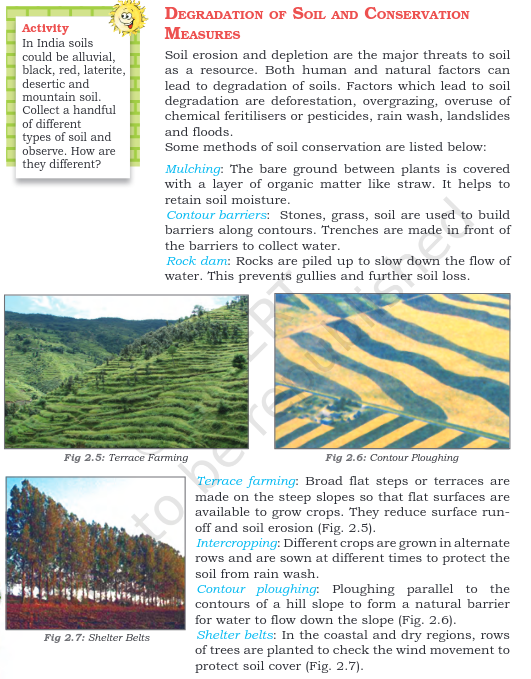

Geography was very poorly taught to me in middle and high-school, reduced down to knowing what crops grew where and what winds blew how and dry paragraphs on tectonic plates and what not. But six years after high-school, I'm learning  

Out of the three 'social-studies' subjects (civics and history being the other two), I found geography to be the worst class to sit through and truly despised those thirty-forty minutes of the day. The last proper geography class I had was in the eight grade, and granted that there's only so much you can talk about at that level but the books are so dry, mostly listing out definitions of physical qualities one after the other; terms to be memorized for an exam. Take a look at this snippet [from the grade 8 NCERT](https://ncert.nic.in/textbook.php?hess4=2-5) textbook:

I look at this and now I'm thinking, "Okay...and?". This is one of many examples.

Your view might differ on this, and maybe I'm expecting too much from a 8th grade government textbook, but I think there are two things fundamentally missing from text like this: 

1. The absolute lack of conversational storytelling (that might have the consequence of leaving some sort of positive impact on the kids reading it). 
2. Decoupling geography from the history, people and culture that it inevitably ended up affecting. Things being just about "where" and "what" and not "why there", "who for". 

The lack of a storytelling aspect is true of most Indian textbooks. The school year is structured around _getting things done_ and teachers have a checklist of things to go through because the half-yearly and the final exams are always at hand. 'There just isn't _time_ to indulge in things like storytelling because how else will the syllabus be completed?'. I can hear these replies in my head because school is still quite fresh in my mind. Of course, these arguments are stupid, because the entire scaffolding of the Indian education system is garbage. That's a longer, beaten-to-death talking point so I'm not going to get into that here. 

But storytelling is crucial. That is how we remember things, care about them and connect 