<style>
  img {
    max-height: 500px;
    width: auto;
  }
  
  .widget-name {
    display: inline-flex;
    align-items: center;
    gap: 8px;
  }
  
  td .widget-name {
    flex-direction: row;
  }
</style>

<script>
import ProTip from '$lib/components/Blog/ProTip.svelte';
import WidgetIcon from '$lib/components/Blog/WidgetIcon.svelte';
</script>
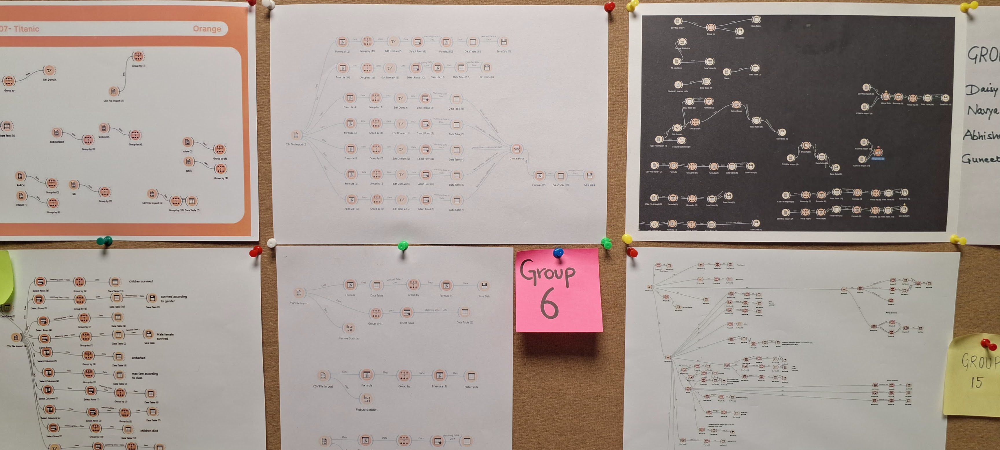

I recently taught a 10-day data visualization class to 2nd year design students at Chitkara University. This was my first teaching experience in any real sense (I've "taught" groups of students informally at Srishti), and an exciting opportunity! It became a learning experience as much for me as it was for the students because the code-brained, R-pilled person that I am, I had to adapt my explanations to a no-code context (which, in my opinion, is a lot harder than just doing some R!).

When I started planning the course, few options immediately jump out for visualization. Datawrapper, RawGraphs, and Flourish are incredible and don't need much elaboration (well, at least here). No-code viz sorted.

_But what about data wrangling and analysis?_ You need practical data skills too! Charts are sometimes the easier part. The information _you_ care about is rarely going to come in the form of a neat summary ready to be plugged into Datawrapper. In any real-world scenario, you're met with anywhere from 100-30,000 rows of data (which, by the way, my no-code students handled too!) and you need to summarise it to a manageable amount of information. In R, this is usually done through the `dplyr` package.

If you're unfamiliar with R or tidyverse, dplyr functions essentially create a grammar for data manipulation that makes complex operations straightforward. Each function does one specific task well, and when combined, they transform raw data into analysis-ready formats. If you're a Python person, `pandas` helps you do the same (but dplyr has superior syntax by far, sorry). The code approach makes your analysis both readable and reproducible, and the challenge was finding a tool that offered these same benefits without requiring students to learn programming syntax. 

So this was a big stumbling block. Visualization is alright, but how do I do _that_? One _could_ do this in Excel or Google Sheets but, lord, it is hard. I think it is harder than writing R code. And more importantly, it is _destructive_ (modifies the original data) and not replicable. I had ~80 students in my class and it is not feasible to show them step-by-step Excel operations, and the steps aren't self-documenting. Writing code for analysis means your operations are replicable, reviewable and reusable (what if the data is updated?), Excel is none of those things and therefore not an option.

## What is Orange?

[Orange](https://orangedatamining.com/) is a wonderful visual programming tool for data analysis. This was introduced to me by my former professor, [Arvind Venkatadri](https://arvindvenkatadri.com/). He is a brilliant teacher and even has an extensive[ 'Data Science with No-Code'](https://av-quarto.netlify.app/content/courses/nocode/listing) public course where he uses Orange, which I also learnt from.

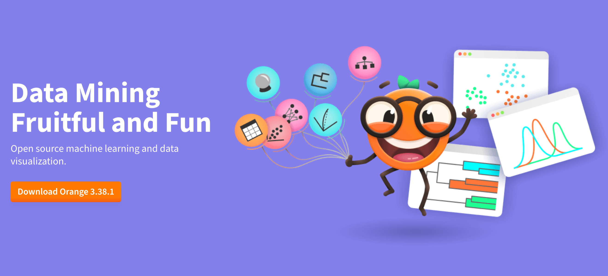

It works as a node-based visual interface with 'widgets' that perform operations that range from analysis to simple visualization. Orange files can contain workflows with annotations that can be shared, and are entirely replicable and non-destructive. That is, the source data is never modified but just _transformed_ from one step to another and can be shared with others (unlike Excel shenanigans). Each widget represents a specific data operation, and connecting them creates a visible data pipeline. This helps students understand not just what transformation happened, but how and why. When someone asks "where did these numbers come from?" the entire workflow provides the answer.

In this post, I'm going to use the [iris dataset](https://www.kaggle.com/datasets/uciml/iris) (which comes in-built with Orange) to show you how Orange can be used for data manipulation and exploratory analysis, as well as the equivalent dplyr functions it replaces. 

If you'd like to follow along, download Orange and then the workflow file to play with this yourself. 

Here's a non-definitive list of extremely common things I find myself reaching for R/dplyr for:

| dplyr Function              | Orange Widget              | Description                                              |
| --------------------------- | ---------------------------------- | -------------------------------------------------------- |
| `filter()`                  | <span class="widget-name"><WidgetIcon widgetName="Select Rows" />Select Rows</span> | Filter data based on conditions                          |
| `select()`                  | <span class="widget-name"><WidgetIcon widgetName="Select Columns" />Select Columns</span> | Choose specific columns to keep                          |
| `arrange()`, `slice()`      | <span class="widget-name"><WidgetIcon widgetName="Select Rows" />Sort, Select Rows</span> | Order rows by values of columns, Select rows by position |
| `mutate()`                  | <span class="widget-name"><WidgetIcon widgetName="Formula" />Formula</span> | Create new variables/columns                             |
| `summarise()`, `group_by()` | <span class="widget-name"><WidgetIcon widgetName="Group By" />Group By + Aggregate </span> | Summarize data with statistics                           |
| `join()`                    | <span class="widget-name"><WidgetIcon widgetName="Merge Data" />Merge Data</span> | Combine datasets (left, right, inner joins)              |
| `bind_rows()`               | <span class="widget-name"><WidgetIcon widgetName="Concatenate" />Concatenate</span> | Stack datasets vertically                                |
| `distinct()`                | <span class="widget-name"><WidgetIcon widgetName="Unique" />Unique</span> | Keep only unique/distinct rows                           |
| `rename()`                  | <span class="widget-name"><WidgetIcon widgetName="Edit Domain" />Edit Domain</span> | Rename variables/attributes                              |
| `count()`                   | <span class="widget-name"><WidgetIcon widgetName="Group By" />Group By Aggregate (Count) </span>| Count occurrences by group                               |
| `pivot_wider()`             | <span class="widget-name"><WidgetIcon widgetName="Pivot" />Pivot</span> | Reshape data from long to wide format                    |
| `pivot_longer()`            | <span class="widget-name"><WidgetIcon widgetName="Transpose" />Transpose</span> | Reshape data from wide to long format                    |
For the last two, I have created a separate tool called [Pivotteer](https://pivotteer.netlify.app) as well, which I will explain in another post.

## Common data operations with Orange

The idea behind Orange is quite simple. It is node-based, which means that operations are represented as visual blocks (called widgets) that can be connected together to create a data flow. Think of each widget as a specialized tool that does one specific job - filtering rows, selecting columns, or calculating statistics.
When you connect these widgets with lines, you're essentially building a pipeline where data flows from one operation to the next. The output of one widget becomes the input for the next, creating a visual representation of your data transformation process. Here's a typical pipeline:

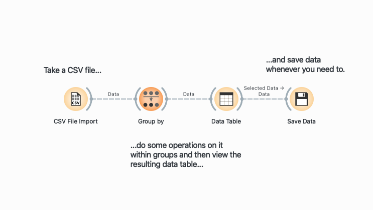

Throughout this post, I provide the R/dplyr equivalents for each Orange operation. This is helpful if you're already familiar with R and want to understand Orange in terms you know, or if you're teaching students who might eventually transition to coding.
### summary(), glimpse() → <span class="widget-name">Feature Statistics<WidgetIcon widgetName="Feature Statistics" /></span>

You've loaded in your dataset and you'd like a very high-level overview of all variables, their data types and some other numeric summaries. No need to code anything, just plug your dataset into the <span class="widget-name">Feature Statistics<WidgetIcon widgetName="Feature Statistics" /></span> widget and open it (click on the widget) to see clean summaries and histograms pop up immediately.

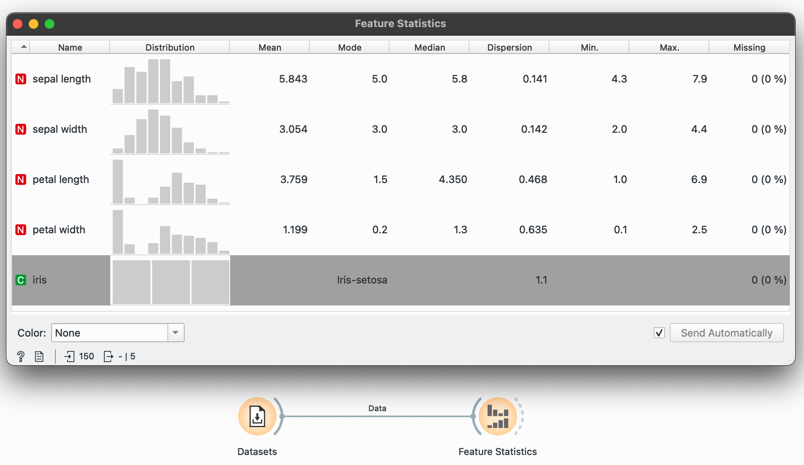

This is useful stuff! Right away, we know the central tendencies of each variable (mean, median, mode), their dispersion around the center, the range of values (min and max) as well as if any data points are missing (none here). You could _also_ color these histograms by a categorical variable at this point just to get a feel of the data. 

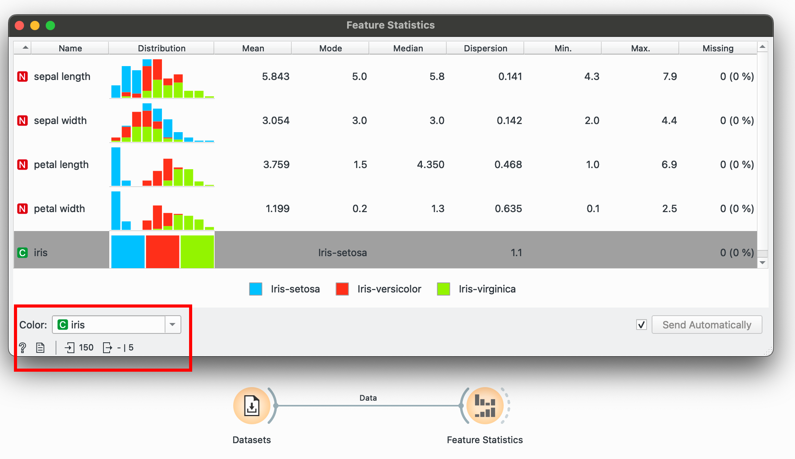

The virginica species seems to have a larger petal width on average. And I didn't even have to do much to know this!

```r
# R equivalent 
summary(iris) 
glimpse(iris)
```

<ProTip>

When you connect a <span class="widget-name">Group By<WidgetIcon widgetName="Group By" /></span> for the first time, all aggregations might be selected. To unselect, select anything in the right pane and press `CTRL+A` to select all, and then manually uncheck everything till no aggregations show up (this might take a few clicks). In the image above, I've unselected everything but only selected 'Mean' for petal length.
</ProTip>

### filter() → <span class="widget-name">Select Rows<WidgetIcon widgetName="Select Rows" /></span>

Filtering is done through the <span class="widget-name">Select Rows<WidgetIcon widgetName="Select Rows" /></span> widget, which has comprehensive conditions for numeric, categorical and temporal data. Add multiple conditions easily. 

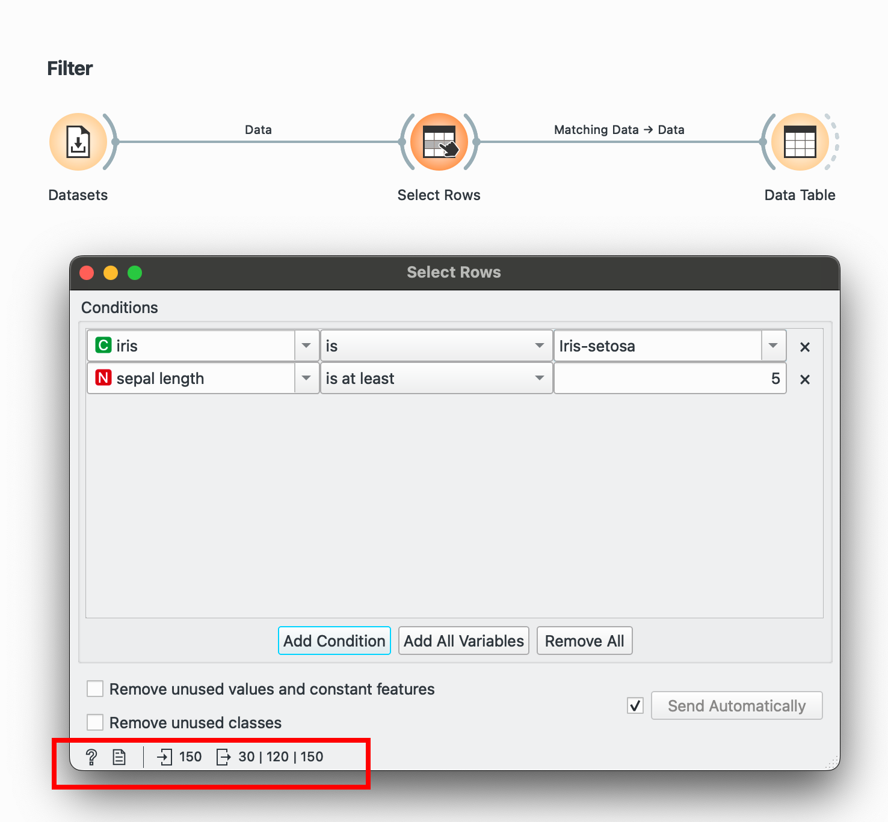

Another tip to see the before/after for any widget: On the bottom-left corner, you'll notice `150` followed by `30`. This means we took _in_ 150 rows and after this process are _sending out_ only 30 rows. 

```r
# R equivalent
data %>%
	filter(species == "Iris-setosa", sepal.length > 5)
```

### select() → <span class="widget-name">Select Columns<WidgetIcon widgetName="Select Columns" /></span>

To keep only specific columns, use the <span class="widget-name">Select Columns<WidgetIcon widgetName="Select Columns" /></span> widget to decide which ones to keep. Here, I select only `petal width` and `petal length` and press `1` to select or unselect it. Once again, to check if your operation had any update, check the bottom-left corner. Here we have 150 rows and only 3 columns being sent forward.

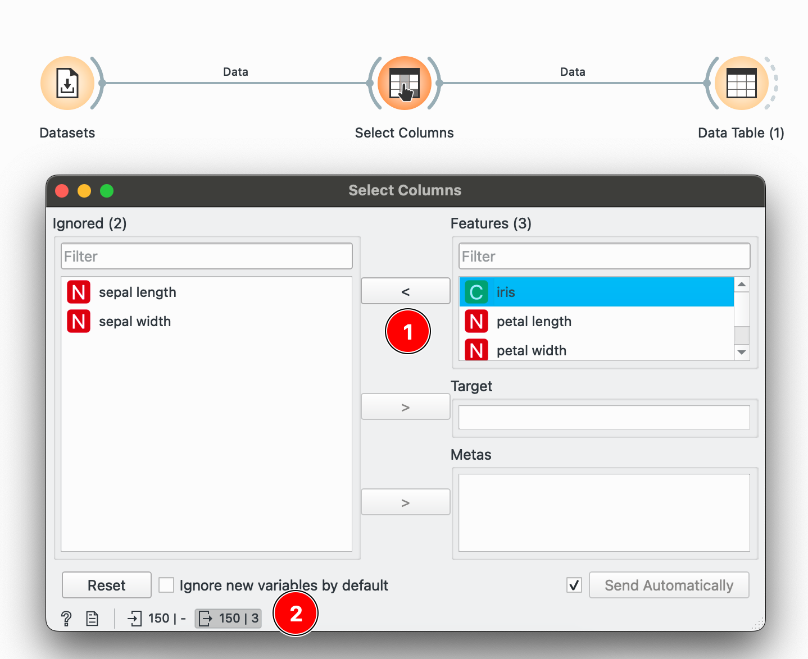
```r
# R equivalent
data %>%
	select(species, petal.length, petal.width)
```
### arrange(), slice() → <span class="widget-name">Data Table<WidgetIcon widgetName="Data Table" /></span>

The <span class="widget-name">Data Table<WidgetIcon widgetName="Data Table" /></span> widget is used to view the data at any point of the workflow but also retains any selections or sorts that are applied and carries them forward. 

Sorting by `sepal length` or any other variable can be done by clicking the column name and switching between ascending or descending order. `Restore Original Order` resets all changes. 

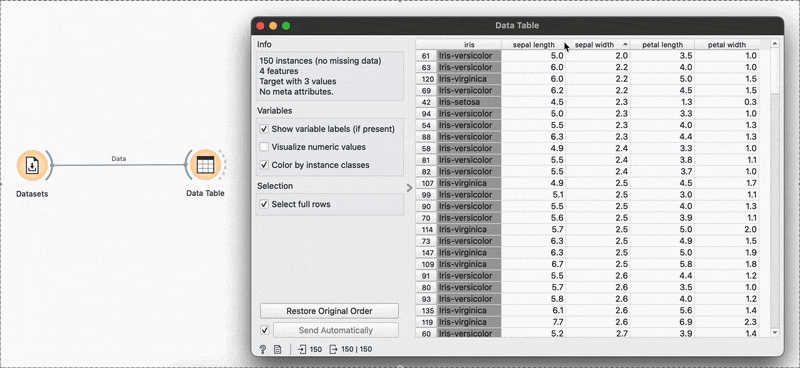
```r
# R equivalent
data %>%
	arrange(-sepal.length)
```

You can also make selections that are arbitrary and manual, or sort by a column and then select the 'top N' rows you'd want. For example, I want to select top 10 flowers by `sepal length`. Easy! Sort by the relevant column and hold `Shift` as you select from the first to the 10th column. 

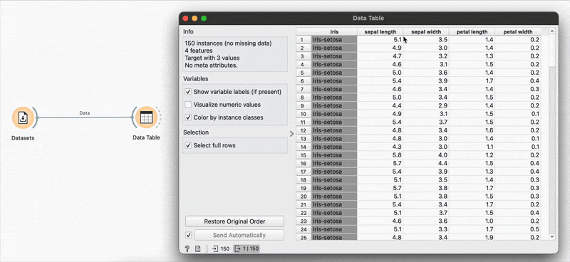
Connecting to another <span class="widget-name">Data Table<WidgetIcon widgetName="Data Table" /></span> shows that the sorting and the selection has been retained. 
```r
# R equivalent
data %>%
  arrange(desc(sepal.length)) %>%
  slice_head(n = 10)
```

### mutate() → <span class="widget-name">Formula<WidgetIcon widgetName="Formula" /></span>

`mutate()` is a function I reach for the most in R. It helps in creating a new column or a column 'based on something' that references another variable. Orange makes this available through the <span class="widget-name">Formula<WidgetIcon widgetName="Formula" /></span> widget which lets you create a new type of variable (numeric, temporal, categorical) by operating on some existing variable or any condition. 

If we want to convert only `sepal length` to millimetres, then we can create a new numeric column that multiplies it by 100. 

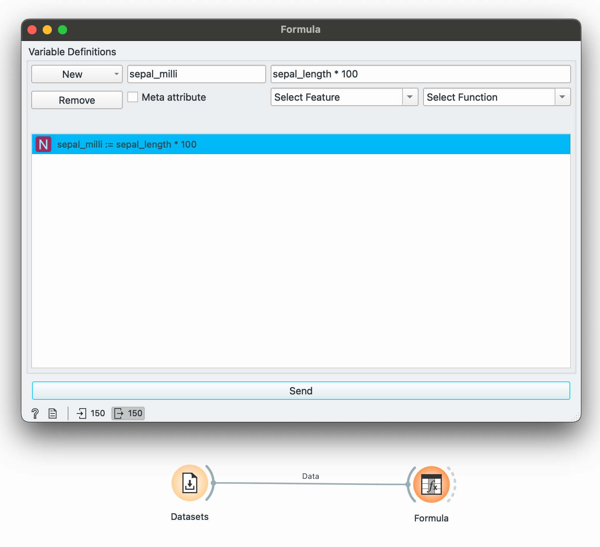

Or perhaps, you want to create a new categorical variable at the same time that checks if a species is `Iris-setosa` and if yes, write `TRUE`. Add another formula in the same widget and write a conditional: 

```python
"TRUE" if iris == "Iris-setosa" else "FALSE"
```

Viewing the data now, we see that two new columns have been created (or 'mutated'). 

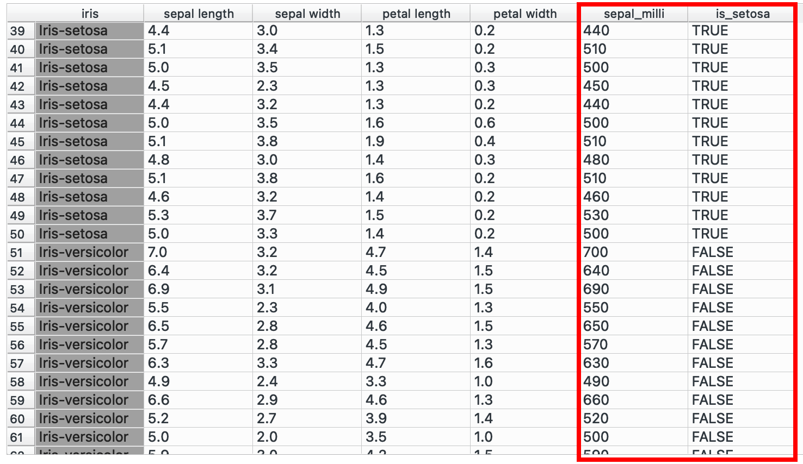

```r
# R equivalent
data %>%
	mutate(sepal_milli = sepal.length * 100,
		   is_setosa = if(species == "Iris-setosa", TRUE, FALSE))
```

You could also created nested conditions! Classify sepals into big, medium, small categories maybe?

```python
"Big" if sepal_length > 6 else "Medium" if sepal_length > 4 else "Small"
```

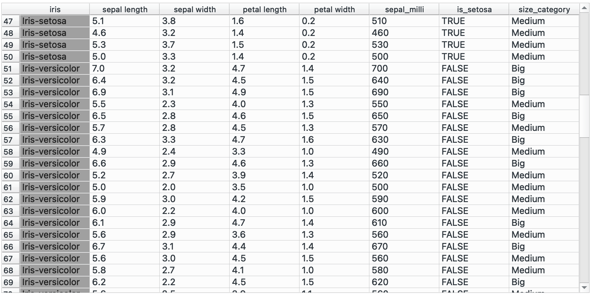

```r
# R equivalent
data %>%
  mutate(sepal_size = case_when(
    sepal.length > 6 ~ "Big",
    sepal.length > 4 ~ "Medium",
    TRUE ~ "Small"
  ))
```
### group_by(), summarise() → <span class="widget-name">Group By<WidgetIcon widgetName="Group By" /></span>

`group_by()` in dplyr is the starting point for almost any data summarization task. It takes your data frame and essentially says "treat these rows that share the same values as distinct groups." Once you've grouped your data, any operations you perform afterward (like calculating averages or counts) happen separately within each group rather than across the entire dataset.

Orange provides this interface with the <span class="widget-name">Group By<WidgetIcon widgetName="Group By" /></span> widget that has various options for aggregations (operations you want to do within the groups). For example, suppose we want to calculate the average petal length for each species. 

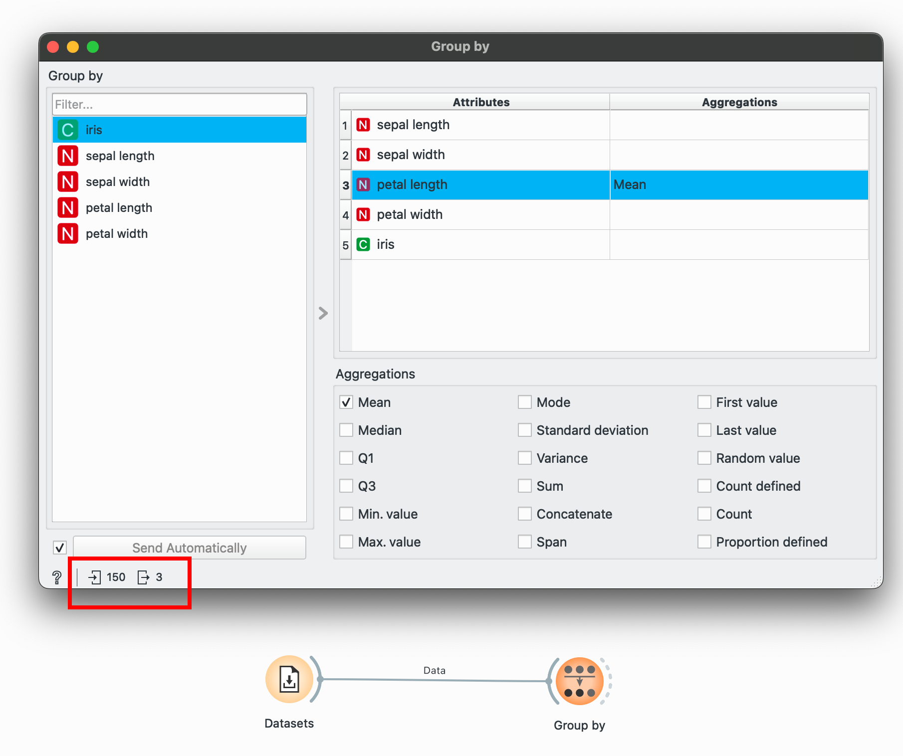

<ProTip>

To select multiple categorical groups, hold `CTRL` as you make selections in the left pane to do operations within multiple groups. 
</ProTip>

Select a categorical variable (marked with a green C in Orange) and then select `petal length` and check `Mean`. Notice the bottom-left again? We've summarised our data from 150 rows to only 3! 

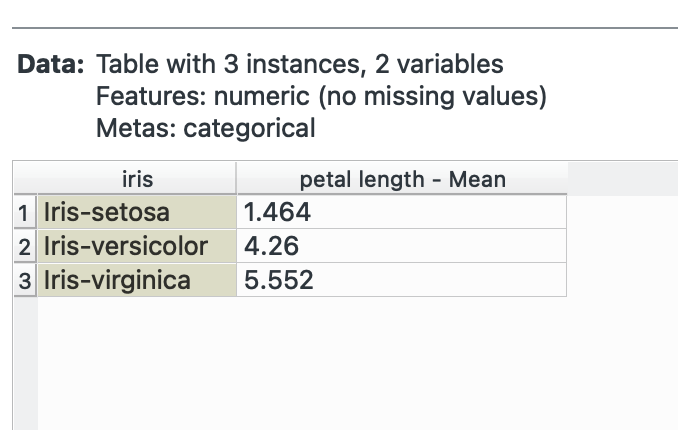

`Group By` is incredibly, incredibly powerful. Most of your EDA needs will be taken care of over here. 

```r
# R equivalent
data %>%
	group_by(species) %>%
	summarise(mean_petal_length = mean(petal_length))
```
### join() → <span class="widget-name">Merge Data<WidgetIcon widgetName="Merge Data" /></span>

The various joins in dplyr (right_join, left_join, inner_join etc.) help in combining data **horizontally**. Maybe you have two different datasets with a common column that you wish to merge into one, this widget is your friend. 

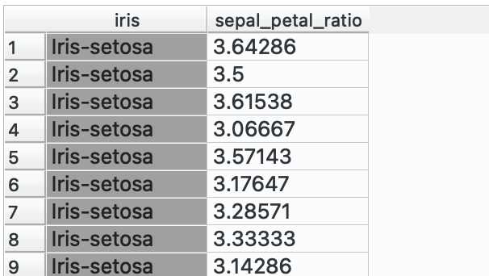

In this example, I'm going to create a dummy complementary dataset which only has the flower species and a `sepal_petal_ratio` and I need to join it into the main dataset. Plus both into <span class="widget-name">Merge Data<WidgetIcon widgetName="Merge Data" /></span> (which takes only two at a time) and select 'Find Matching Pairs of Rows' and voila!

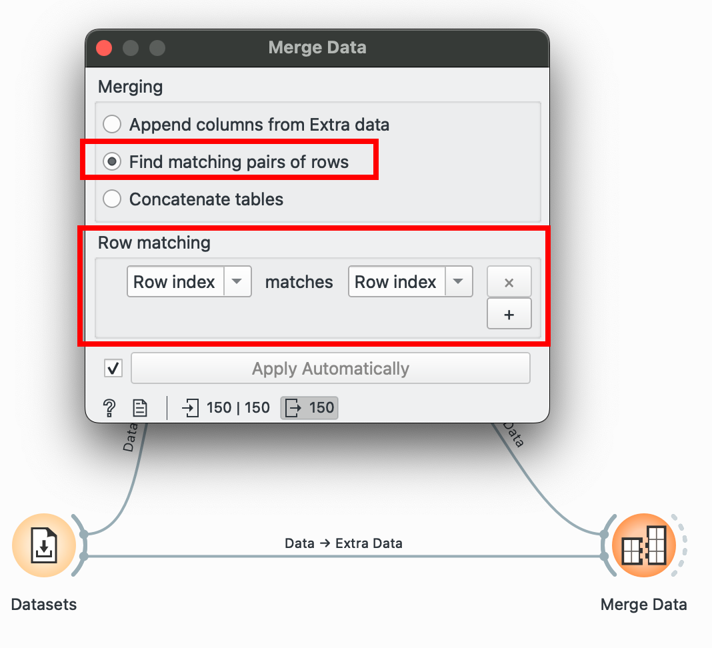

Here, we matched only by 'Row Index' since I know that the order of the data in both datasets is the same, but if it isn't, you can choose to match by any other 'ID' column! This column will usually be categorical or a unique numeric ID. 

This is pretty useful also for when you separate your workflows and work on various branches individually and want to join it back into one consolidated dataset. 

```r
# R equivalent
# Assuming we have a second dataset with sepal_petal_ratio 
data %>% 
	left_join(ratio_dataset, by = "row_index")
```
### bind_rows() → <span class="widget-name">Concatenate<WidgetIcon widgetName="Concatenate" /></span>

The other alternative to joining datasets horizontally: stacking them vertically! You have two separate datasets with the same column names and want to combine them, plug 'em into this! Unlike <span class="widget-name">Merge Data<WidgetIcon widgetName="Merge Data" /></span>, this can take in numerous inputs, just be sure that the number of columns and their names match. 

I have two separate datasets, one for each species and I'd like to combine them into one:

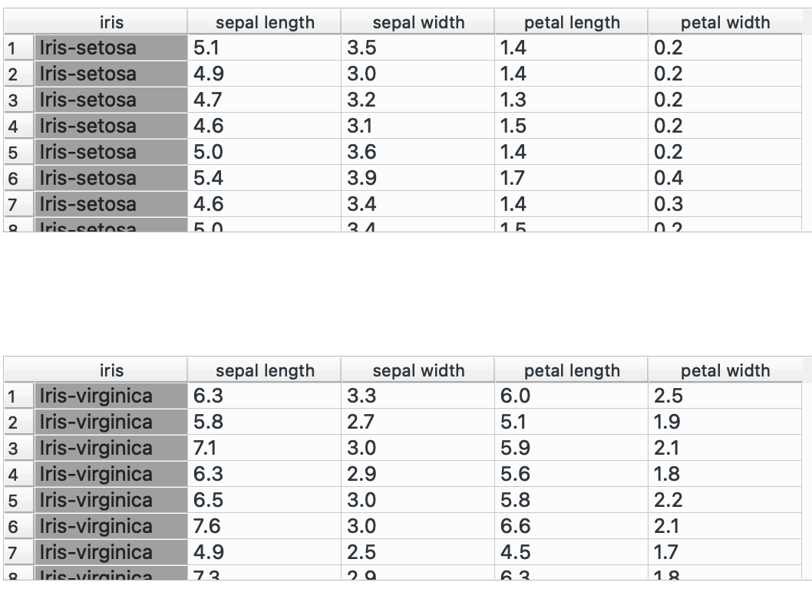

Pulling both of these nodes into <span class="widget-name">Concatenate<WidgetIcon widgetName="Concatenate" /></span> shows me that I went from having 50 and 50 rows to one data table containing 100 rows. Success! 

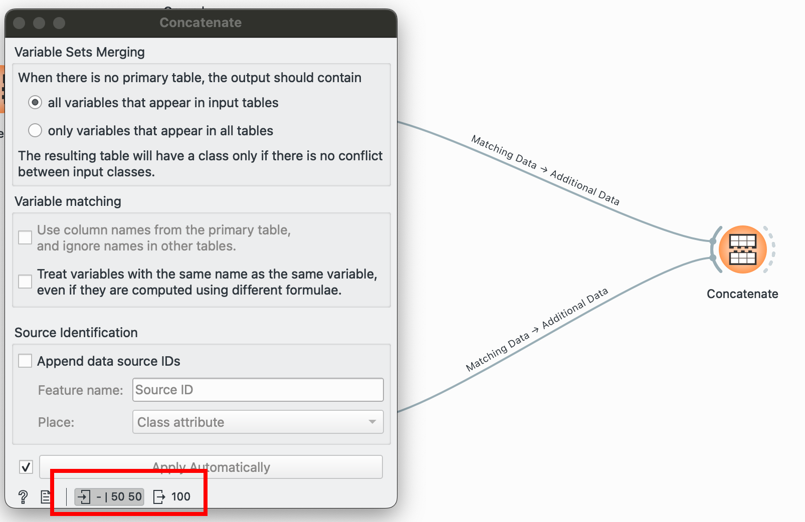

```r
# R equivalent
bind_rows(setosa_data, versicolor_data)
```
### rename() → <span class="widget-name">Edit Domain<WidgetIcon widgetName="Edit Domain" /></span>

Sometimes, you might want to clean up unsightly column names. Or Orange might not have interpreted your variable type correctly (date showing up as categorical). For these needs, plug your dataset into <span class="widget-name">Edit Domain<WidgetIcon widgetName="Edit Domain" /></span> and make your modifications. Here I add underscores instead of spaces.

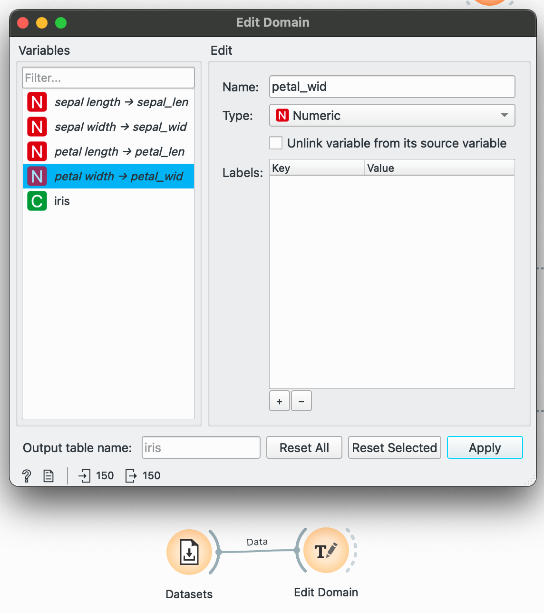

Remember to click 'Apply' to actually save your changes. 

<ProTip>

While examining your dataset initially, ensure that Orange has not left any variable in a black `T` (random text) and it is either a green C for categorical, red N for numeric or blue `T` for Time. 
</ProTip>

```r
# R equivalent
data %>%
  rename(sepal_length = "sepal length",
         sepal_width = "sepal width",
         petal_length = "petal length",
         petal_width = "petal width")
```
## The pivots

`pivot_longer()` and `pivot_wider()` are crucial functions for visualizations. Tools like RawGraphs expect data in the long, tidy format but if you want to visualize comparisons in Datawrapper, you need the wide format, with a column for each comparison (for instance, two separate lines for men and women for a life expectancy over time chart)

There are ways to do this in Orange which I will show below, but things can get limiting fast if your dataset is complex. The dplyr functions are one of the cleanest implementations of this operation I've seen so far, so much so that I built a UI for them called [Pivotteer](https://pivotteer.netlify.app) which I recommend students use instead in case Orange gets too difficult. But in the spirit of adventure, here is how to do it within the software.

I will need to switch datasets for this so I am going to use the 'Naughty or Nice' dataset that Orange has built in. 
### pivot_longer() → <span class="widget-name">Melt<WidgetIcon widgetName="Melt" /></span>

This is our original dataset, currently in a wide format. We want to have only one observation per row (score, name, value) and therefore need to make it longer.

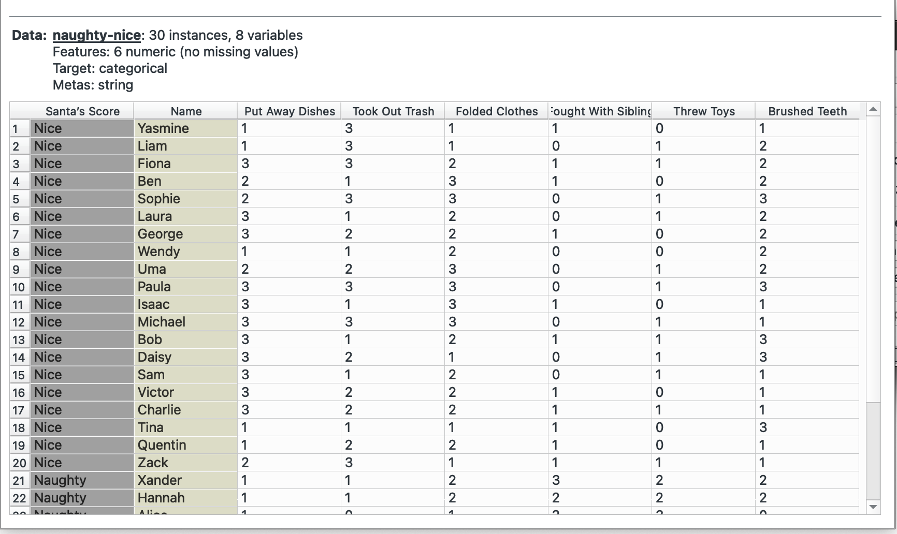

Plug this into 'Melt'. We want to create a combined column for all chores called `task` and note their value in another column called `times`. We select `Name` as our unique column since that represents each individual. The widget offers only columns without duplicated values so we cannot keep the Santa's score column.

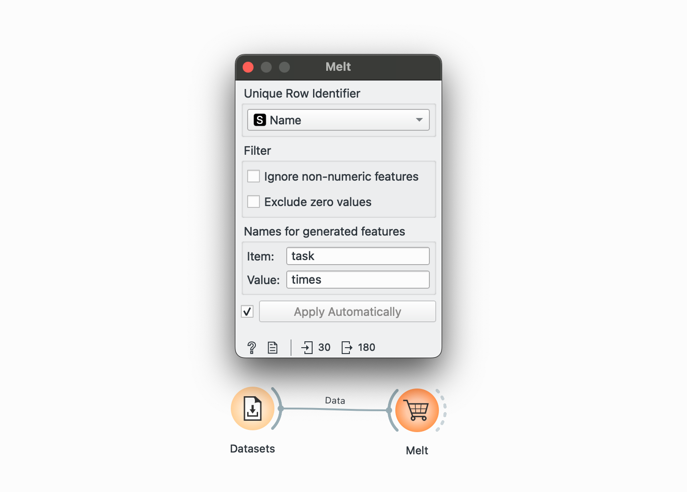

Look at the bottom left again, we've gone from 30 rows to 180. Now our dataset is longer! This is what it will look like: 

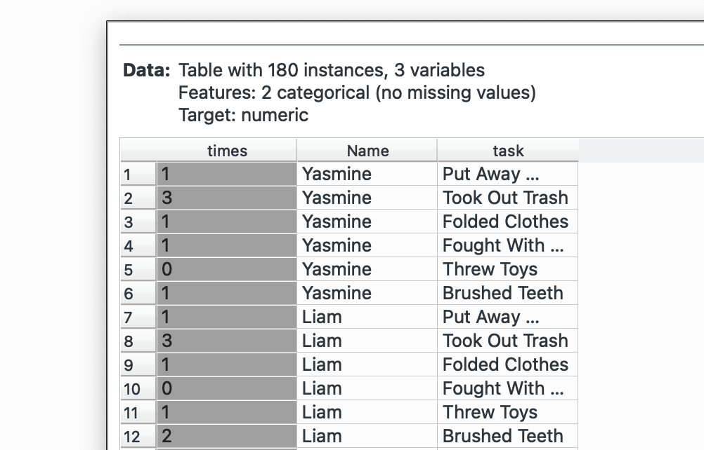

Unfortunately, our Santa's Score column did not carry over. But we could probably add that back in using <span class="widget-name">Merge Data<WidgetIcon widgetName="Merge Data" /></span> and joining by `Name`! 

<ProTip>

Use [Pivotteer](https://pivotteer.netlify.app) for this. It provides the same functionality but keeps the other columns. 
</ProTip>

```r
# R equivalent - this preserves all id columns automatically
data %>%
  pivot_longer(
    cols = c(Cookies, Charity, Homework, Tantrums, Whining, Bullying),
    names_to = "task",
    values_to = "times"
  )
```
### pivot_wider() → <span class="widget-name">Transpose<WidgetIcon widgetName="Transpose" /></span>

Instead of having each chore as a column, maybe I want to have chores are individual rows and the names as columns (that way, I can plot each Name as a bar in a grouped-bar chart in Datawrapper, maybe). Well, simple again.

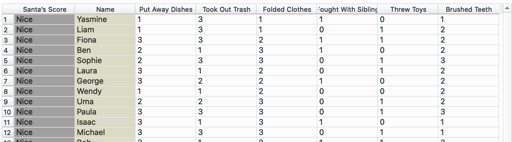

Bring out your <span class="widget-name">Transpose<WidgetIcon widgetName="Transpose" /></span> widget and plug it into the dataset. We want to create columns from `Name`. Looking at the in vs. out at the bottom-left corner, we see that we've gone from 30 to 6 rows only (now our data is _wider_ than it is longer). 

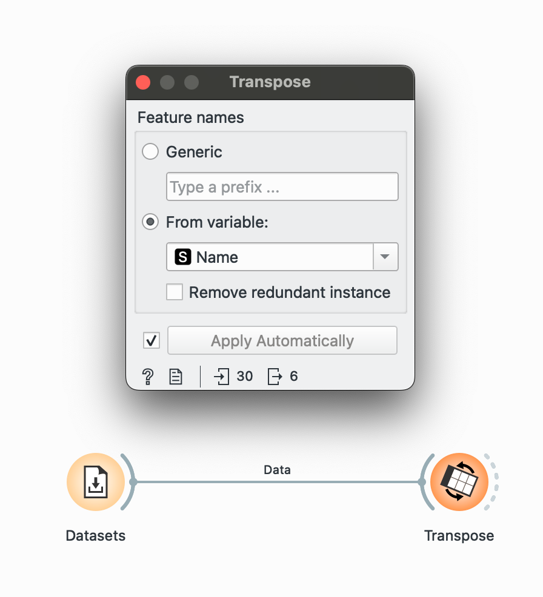

Awesome, now we have a column for each name! But again, we will lose the 'Santa's Score' column.

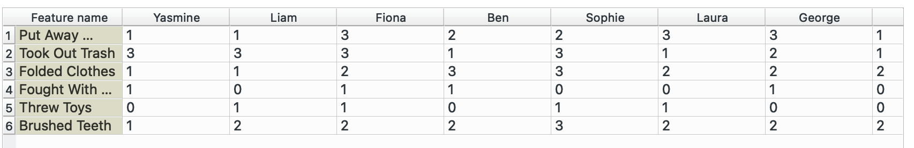

## write_csv() → <span class="widget-name">Save Data<WidgetIcon widgetName="Save Data" /></span>

Lastly, you can save data from the pipeline at any point by plugging the output of a widget into the <span class="widget-name">Save Data<WidgetIcon widgetName="Save Data" /></span> widget and write it to a CSV. 

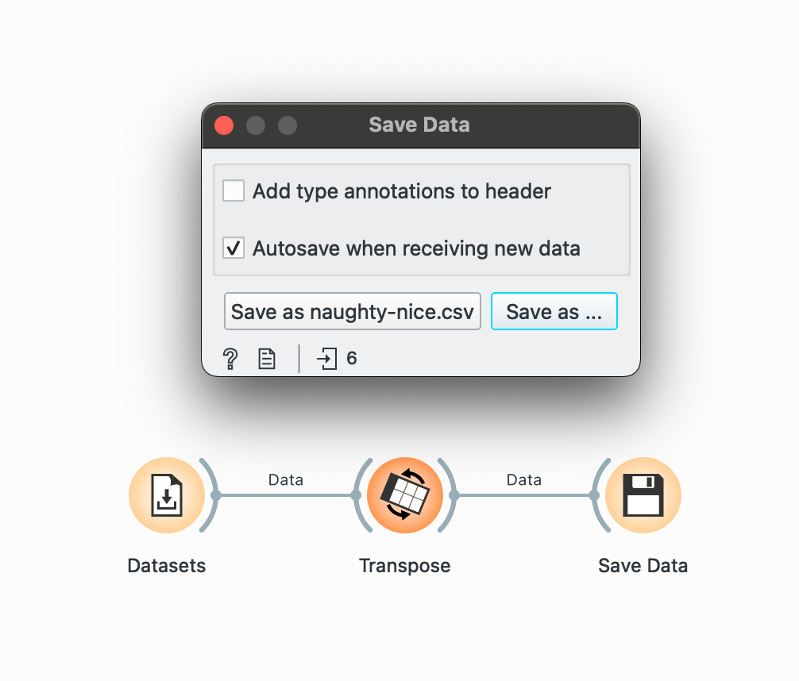

The two things you need to remember here are unchecking the 'Add type annotations' box (which creates an unnecessary row with data types) and checking the 'Autosave' box to continuously keep your output CSV updated if any part of the pipeline changes. By default, Orange selects 'TSV' format so change that to CSV by clicking `Save As` too!

```r
# R equivalent
write_csv(data, "final_analysis.csv")
```
## Orange you glad this exists

Orange is great, but I'll be real - it has its quirks. The main limitation I found while teaching is that some operations that are straightforward in R can be a bit roundabout in Orange. The pivot functions are the most obvious example. While they work, they're not as flexible as their R counterparts. The learning curve is also variable; it's definitely easier than coding for beginners, but I found it's still a cognitive leap for students who've only used Excel. That said, once students got the hang of it, they could perform surprisingly complex operations that would've taken me much longer to teach in Excel.

This has been a long post, but I hope you see why I'm so enthusiastic about Orange! For teaching data wrangling in a no-code context, it's been invaluable. My students, despite having zero prior data experience, were able to handle datasets with thousands of rows, perform operations, and create visualizations by the end of our 10-day course. And who knows, it might just make your students curious enough to dip their toes into actual coding later on (which happened with a few of mine haha)!